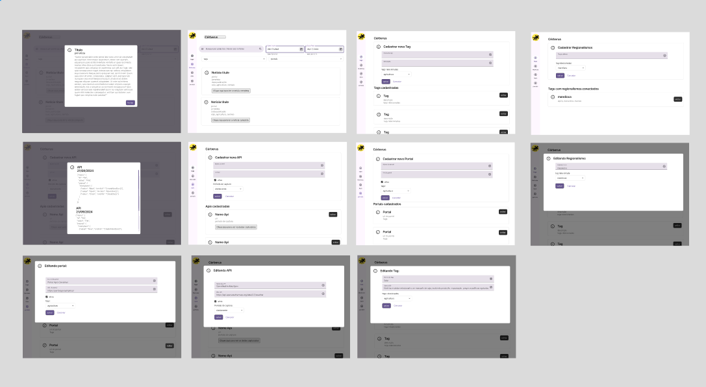

# Rascunho Metodologia

# Marília Borgo de Moraes

## Introdução

Sou Marília Borgo de Moraes, estudante de Banco de dados pela FATEC. Minha trajetória acadêmica e profissional tem sido marcada pelo desenvolvimento de soluções inovadoras na área de tecnologia. Durante minha formação, participei de diversos projetos que envolveram desde o desenvolvimento de sistemas web até ao webscrapping de dados.

## Contatos

- [GitHub](https://github.com/marilia-borgo)
- [LinkedIn](https://www.linkedin.com/in/mariliaborgo/)

## Meus Principais Conhecimentos

- **Desenvolvimento Web Full Stack**: Experiência sólida em front-end e back-end, utilizando tecnologias como Vue e SpringBoot.
- **Banco de Dados**: Conhecimento em banco relacionais, principalmente postgres e oracle.
- **DevOps**: Familiaridade com ferramentas de integração e entrega contínua, como Docker e Jenkins. Assim como a utilização de  ambiente de desenvolvimento, tal quaiscodespaces e devContainer do vscode.

## Meus Projetos

### Em 2024-2

Durante o segundo semestre de 2024, desenvolvi junto da minha equipe um projeto desafiador focado na captura e armazenamento de notícias estratégicas de portais e dados relevantes de APIs públicas, visando possibilitar futuras análises utilizando inteligência artificial.

**Empresa Parceira**: Projeto acadêmico desenvolvido no âmbito da FATEC, com parceria com a empresa GSW.

**Problema**: A necessidade de uma ferramenta que automatizasse a coleta contínua de dados de portais de notícias e APIs públicas, criando um histórico robusto para análises futuras.

**Solução Entregue pela Equipe**: Desenvolvemos um sistema web que permite o cadastro de portais de notícias, APIs, tags e jornalistas. Implementamos processos de web scraping para coleta automatizada e contínua de dados, armazenando-os de forma estruturada para análises futuras.

[Repositório no GitHub](https://github.com/marilia-borgo/FATEC-API-3-SEMESTRE)

### **Tecnologias Utilizadas**

- **PostgreSQL**: Banco de dados relacional utilizado para armazenar de forma estruturada os dados coletados pelo crawler, como notícias, autores e metadados. Foram implementadas tabelas normalizadas, índices para otimização de consultas e triggers para garantir a consistência dos dados.
- **Docker**: Empregado para containerização da aplicação, permitindo a criação de ambientes isolados para o crawler, API e banco de dados. Utilizou-se **`docker-compose`** para orquestrar múltiplos serviços (PostgreSQL + backend Java), garantindo portabilidade e implantação reproduzível em diferentes sistemas.
- **Java 17**: Linguagem principal do backend, com ênfase em orientação a objetos.
- **Crawler4j + Jsoup**: Bibliotecas integradas para rastreamento e extração de dados. O Crawler4j foi configurado com politeness delay (2s) para respeitar políticas de sites, enquanto o Jsoup parseava o HTML utilizando seletores CSS dinâmicos.
- **Spring Boot**: Framework para desenvolvimento da API RESTful, responsável por expor endpoints. Utilizou-se Spring Data JPA para mapeamento objeto-relacional (ORM) com o PostgreSQL.
- **Maven**: Gerenciador de dependências para automatização do build, integração de bibliotecas (Jsoup, Spring Boot) e configuração de perfis de desenvolvimento/produção.
- **Vue.js**: Framework web utilizado para construir o frontend da aplicação.

### Contribuições Pessoais

Durante o processo de desenvolvimento do projeto, fui ativa em duas frentes diferentes durante o desenvolvimento: como **product owner**, tive responsabilidades principalmente durante o início do desenvolvimento onde levantei os requisitos, escrevi as histórias de usuário e fiz a ponte entre a minha equipe e o cliente que estávamos atendendo. Na segunda frente que eu atuei como **desenvolvedora full-stack** tive mais influência na construção do crawler que faz o scrapping das notícias. 

No início do projeto iniciei escrevendo o backlog de toda a sprint para conseguirmos iniciar o desenvolvimento real do projeto. Na imagem abaixo, está exibido uma visão geral das telas criadas, que foi utilizado o software Figma para criá-lo e compartilhar entre o cliente e o resto do time.

A partir do design foram criadas as user-stories que podem ser vistas aqui no [github do projeto](https://github.com/c137santos/FATEC-API-3-SEMESTRE/blob/main/documenta%C3%A7%C3%A3o/descri%C3%A7%C3%A3o_user_stories.md), assim sendo durante todo o desenvolvimento do projeto foi-se utilizado as duas documentações apresentadas para guiar a compreensão do que seria desenvolvido nas sprints.

Na frente técnica, o desenvolvimento do crawler demandou uma análise aprofundada das ferramentas disponíveis. Inicialmente, considerei o uso do **Selenium**, mas essa opção foi descartada devido à sua complexidade e sobrecarga desnecessária, uma vez que o projeto não exigia interação com elementos dinâmicos complexos. Da mesma forma, avaliei o **Apache Nutch**, porém sua configuração robusta e requisitos de infraestrutura o tornaram inviável para o escopo do projeto. Após discussões técnicas, a equipe optou por uma solução mais leve e eficiente, combinando o **Crawler4j** para o rastreamento de páginas e o **Jsoup** para a extração e análise do conteúdo HTML.

A implementação do crawler seguiu uma abordagem estruturada, garantindo que ele fosse capaz de rastrear sites de notícias de forma eficaz, respeitando as diretrizes do **robots.txt** e evitando sobrecarregar os servidores de origem.

Durante a implementação, enfrentamos desafios como bloqueios por parte de alguns sites, os quais foram contornados com estratégias como rotação de **User-Agent** e limitação controlada de requisições.

A imagem acima demonstra o código do projeto que escolhe randomicamente um user-agent de uma lista pré-montada de user-agents que será utilizado para fazer a raspagem do dado.

Para garantir a extração precisa das informações dos portais de notícias, utilizamos a biblioteca **Jsoup** em  para realizar o *parsing* do conteúdo coletado pelo **Crawler4J**. Outro dos desafios encontrados foi a variação na estrutura HTML entre diferentes fontes de notícias, o que exigiu uma abordagem flexível e robusta para identificar corretamente os metadados relevantes, como **data de publicação**, **autor** e **título**.

Para contornar esse desafio, implementamos um sistema de **busca por palavras-chave análogas** comumente associadas a esses campos. Por exemplo, para localizar a data de publicação, o algoritmo procurava por elementos HTML contendo termos como *"publicado em"*, *"atualizado em"*, *"data-post"*, ou *"datetime"*, além de verificar atributos como **`meta property="article:published_time"`** ou tags **`<time>`**. Da mesma forma, para identificar o autor, buscamos por expressões como *"escrito por"*, *"autor"*, *"por"*, ou *"author-name"*, tanto em classes CSS quanto em *tags* semânticas como **``**.

Um dos métodos implementados para extrair a data dos arquivos *html*s que foram raspados.

A combinação de **Crawler4j** para o *scraping* e **Jsoup** para o *parsing* inteligente provou ser uma solução escalável e adaptável, garantindo a qualidade dos dados coletados e reduzindo a necessidade de intervenção manual.

Durante o semestre, além da implementação do crawler, participei ativamente da criação das operações **CRUD (Create, Read, Update, Delete)**, fundamentais para a gestão de dados do sistema. Um dos fluxos críticos sob minha responsabilidade foi o **cadastro de regionalismos**, funcionalidade estratégica que direcionava a relevância das notícias coletadas pelo crawler.

Componente .vue onde foi criada a listagem de regionalismos.

### Hard Skills

- **Java e Orientação a Objetos**: Domínio avançado em desenvolvimento Java, aplicando os princípios SOLID, e arquitetura limpa para criar soluções escaláveis e de fácil manutenção. Experiência no desenvolvimento de aplicações robustas utilizando coleções, streams, lambdas e tratamento de exceções, garantindo código eficiente e legível.
- **Web Scraping e Processamento de Dados**: Expertise em extração e interpretação estruturada de dados web utilizando bibliotecas como Jsoup e Crawler4j. Implementação de crawlers eficazes com rotinas de fallback, seletores dinâmicos e tratamento de anti-scraping (roteação de User-Agents, delays estratégicos).
- **PostgreSQL**: Proficiência em modelagem de bancos de dados relacionais, otimização de consultas SQL. Experiência em migração e administração de bancos PostgreSQL em ambientes de produção.
- **Docker**: Domínio na criação, orquestração e gerenciamento de containers, incluindo a configuração de redes, volumes e Docker Compose.
- Vue: Criação de componentes para a divisão adequada de responsabilidades,compreensão de como é feita a comunicação entre sistemas via api.

### Soft Skills

- **Trabalho em Equipe**: Colaboração efetiva em equipes multidisciplinares, promovendo a integração harmoniosa entre front-end, back-end e stakeholders. Facilitação de discussões técnicas para resolver conflitos e alinhar expectativas, garantindo a entrega coesa do produto.
- **Gestão de Tempo**: Planejamento estratégico de tarefas com metodologias ágeis (Scrum/Kanban), priorizando demandas críticas e cumprindo prazos sem comprometer a qualidade. Balanceamento eficiente entre compromissos acadêmicos, projetos pessoais e vida profissional.
- **Comunicação**: Participação ativa em reuniões de sprint, apresentando relatórios claros de progresso e riscos. Habilidade em traduzir requisitos técnicos para linguagem acessível a não-desenvolvedores, assegurando alinhamento entre equipe e cliente.