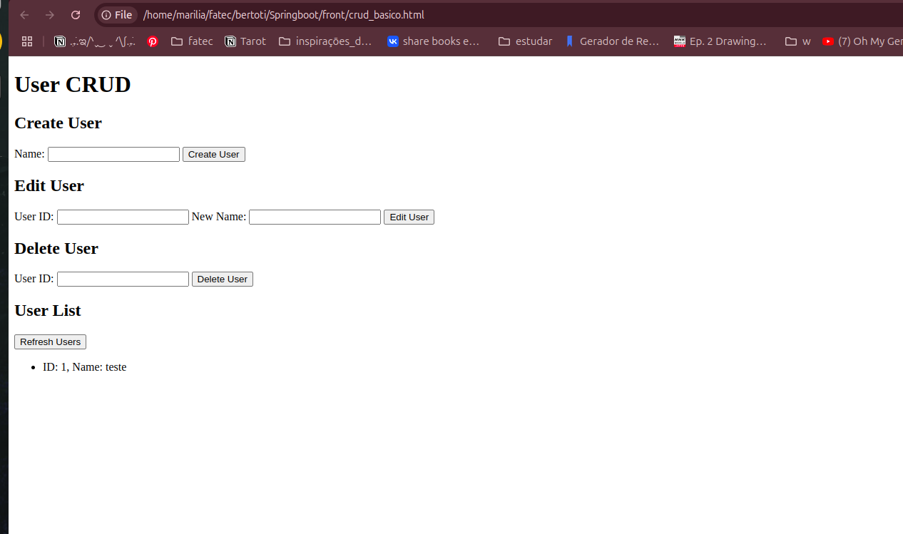
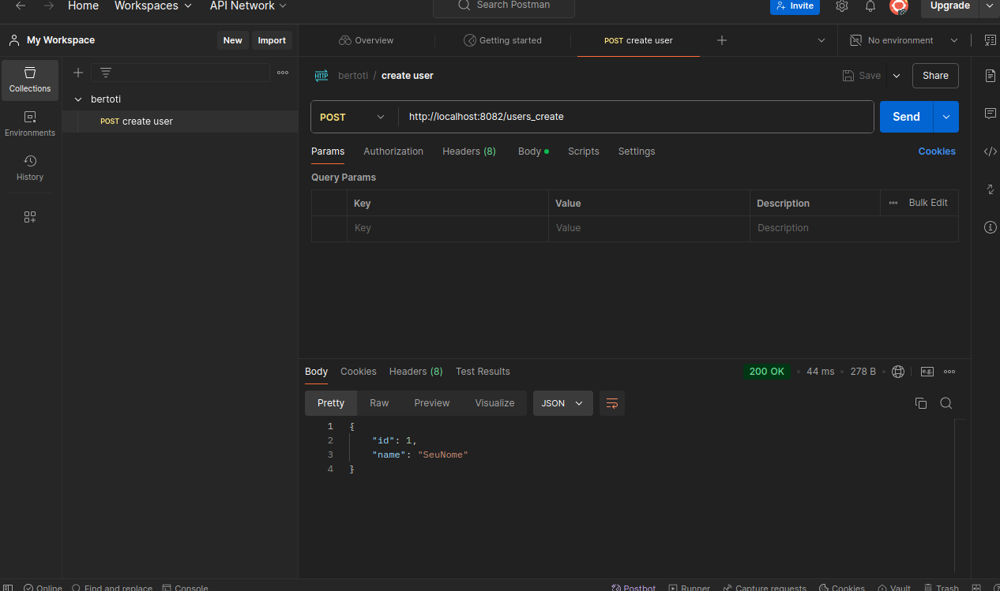
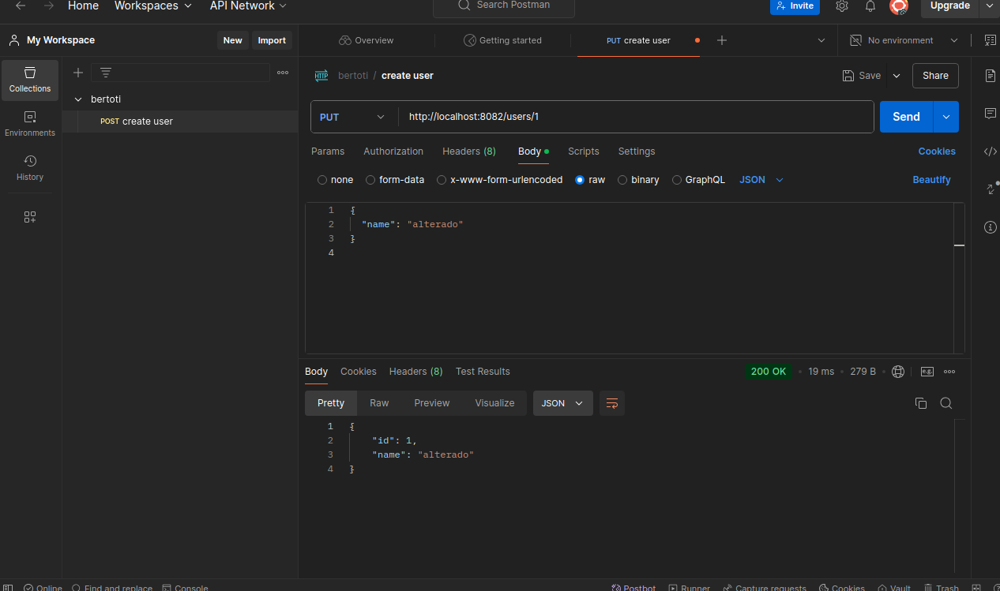
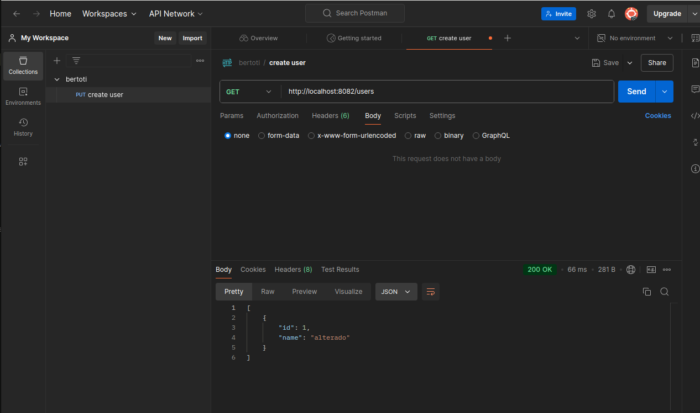
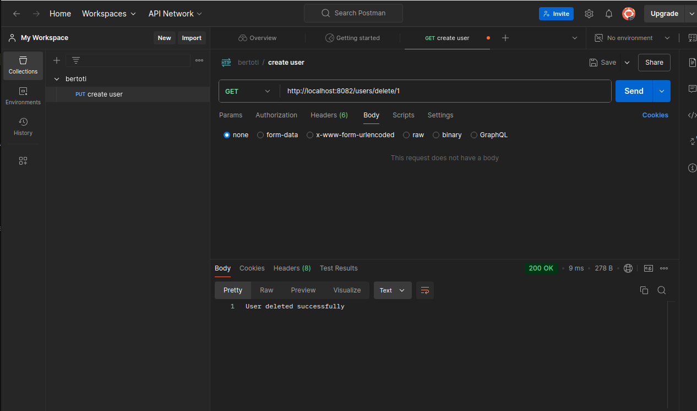

## como rodar o back?
mvn spring-boot:run -Dspring-boot.run.arguments="--server.port=8082"

## Como rodar o front?
Só abrir o arquivo crud_basico.html no navegador.

## Como acessar o swagger?
http://localhost:8082/swagger-ui.html#/user45controller

## Front

# Postman: 

### Create user

### Alterar user

### Listar users

### Deletar user
