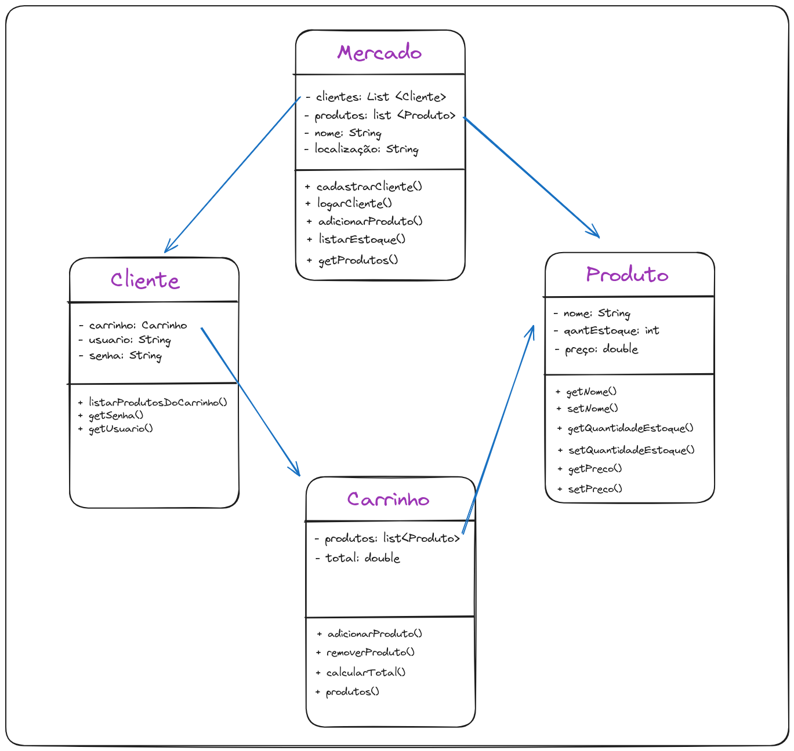
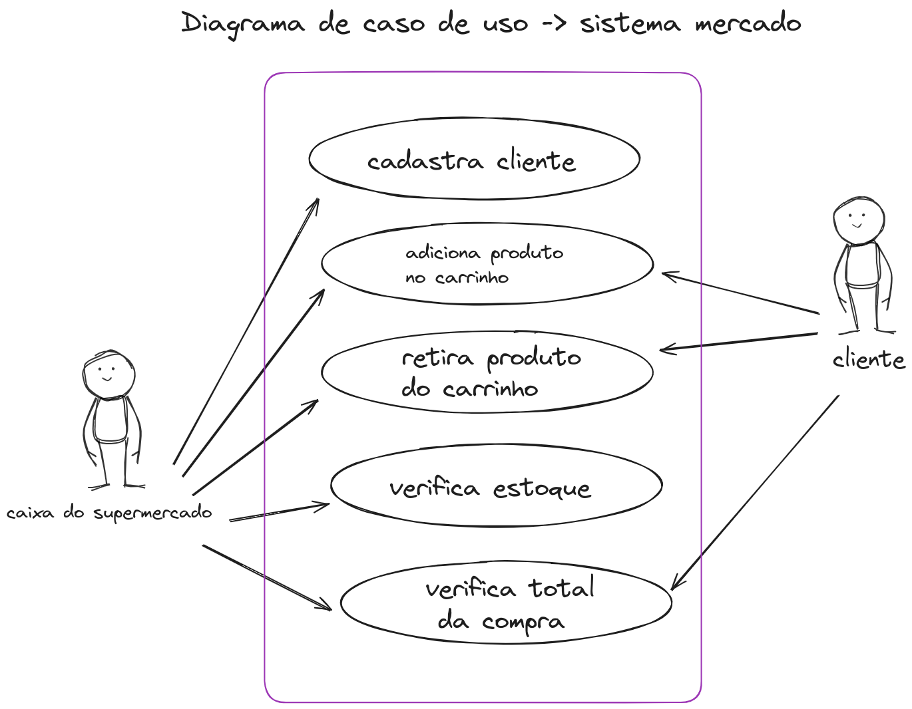

# O que é engenharia de software

Withain Google, we sometimes say, “Software engineering is programming integrated over time.” Programming is certainly a significant part of software : engineering after all, programming is how you generate new software in the first place. If you accept this distinction, it also becomes clear that we might need to delineate between programming tasks (development) and software engineering tasks (development, modification, mmimaintenance). The addition of time adds an important new dimension to programming. Cubes

We see three critical differences between programming and software engineering: time, scale, and the trade-offs at play. On a software engineering project, engineers need to be more concerned with the passage of time and the eventual need for change. In a software engineering organization, we need to be more concerned about scale and efficiency, both for the software we produce as well as for the organization that is producing it. Finally, as software engineers, we are asked to make more complex decisions with higher-stakes outcomes, often based on imprecise estimates of time and growth.

## comentários
A Engenharia de Software é a área interdisciplinar que aplica princípios de engenharia para o desenvolvimento de softwares, desde a análise de requisitos e planejamento até a implementação, testes e manutenção. Envolve a aplicação de métodos, ferramentas e técnicas para garantir a qualidade, confiabilidade, eficiência e segurança do software, atendendo às necessidades dos usuários e dos negócios. Ou seja, não é apenas o ato de programar e sim de toda uma arte a sua maneira para a criação de sistemas.

## Atividade 1 - tempo , escala, trade-off

O **tempo** é um recurso crucial na engenharia de software, impactando o desenvolvimento e entrega do software. Envolve estimativa, planejamento e monitoramento do tempo para garantir a utilização eficiente do recurso e a entrega dentro do prazo.

A **escala** refere-se à capacidade do software de lidar com o aumento da demanda, seja em termos de usuários, dados ou complexidade para garantir a sustentabilidade do software a longo prazo.

**Trade-off** é a escolha entre opções com vantagens e desvantagens. Trade-offs envolvem decisões como tempo vs. qualidade, custo vs. funcionalidade e segurança vs. usabilidade. A escolha ideal depende do contexto do projeto, dos objetivos de negócio e das necessidades dos usuários.

## Atividade 2 - Dê três exemplos de Trade-off
- Decisão entre utilizar um servidor em nuvem vs um servidor local.
- Decisão entre contratar uma empresa externa ou produzir o próprio software.
- Decisão entre utilizar um banco de dados relacional ou um não relacional.

## Atividade 3 - Comentar sobre a arquitetura e baseado em seus trade-offs em que situação aplica-la
[Slides com as arquiteturas analisadas](https://docs.google.com/presentation/d/1Lmad2CS1pM1UycQpYn6FiDm2NsEO6CVSchym65tuk4U/edit#slide=id.g1f2b4e971a0_0_179)

> Layered Architeture Style
Esse tipo de arquitetura possui uma simplicidade alta e um custo muito baixo, porém é diffícil de escalar e de criar novas features, então é ideal para projetos que não tem muitas mudanças como um sistema de mercado.

> Pipeline Architeture Style
A Arquitetura Pipeline é uma aliada da simplicidade e eficiência para processar tarefas sequenciais.Ela se destaca pela alta performance, escalabilidade, facilidade de desenvolvimento e reuso de componentes, porém enfrenta desafios com dependências cíclicas, depuração e flexibilidade. É ótima para a análise de um grande volume de dados, como por exemplo análise de sistemas climáticos.

> Microkernel Architecture Style
A Arquitetura Microkernel prioriza a modularidade e a flexibilidade em Sistemas Operacionais. A Arquitetura Microkernel é ideal para sistemas embarcados, sistemas de missão crítica e sistemas em tempo real, mas exige um design complexo e pode ter um impacto negativo no desempenho.

> Service-Based Architecture Style
Essa organização modular e flexível facilita o desenvolvimento, a manutenção e a atualização do sistema, além de permitir a integração com outros sistemas de forma fácil e rápida. A SOA é ideal para sistemas distribuídos, sistemas em nuvem e sistemas que exigem alta escalabilidade, mas exige um planejamento cuidadoso e pode ter um impacto negativo no desempenho.

> Event-Driven Architecture Style
A arquitetura baseada em eventos é um tipo de arquitetura, por exemplo da Uber, cuja necessidade de respostas rápidas e alta demanda de novas funcionalidades casou com a alta escabilidade eperformance que esse tipo de arquitetura traz, apesar da complexidade e da dificuldde de testar que esse estilo de arquitetura traz.

> Microservices Architecture
A organização modular e descentralizada da arquitetura de microserviços facilita o desenvolvimento, a manutenção e a escalabilidade do sistema, além de permitir a entrega rápida de novas funcionalidades. Ela é ideal para sistemas complexos em constante mudança, mas exige uma cultura DevOps forte e pode ser complexa de gerenciar. Exemplos de sistemas que utilizam essa arquitetura incluem Netflix, Amazon e Spotify.

# Escolha um sistema e baseado nele:

## Atividade 4 - defina sua arquitetura debatendo tradeoffs com os requisitos não funcionais comentados em aula

Imagine um sistema para um caixa de supermercado, onde ele lê um código de barras, e retorna um preço, armazenando numa lista até o final da compra. 

A arquitetura correta para este tipo de sistema é a arquitetura em camadas, onde cada uma performa uma função específica. O baixo custo e a performance necessária ao utilizar o sistema, mais do que compensa a dificuldade de evoluir e escalá-lo.

Em suma, a arquitetura em camadas se configura como a escolha acertada para um sistema de caixa de supermercado que busca eficiência e baixo custo. Sua estrutura modular proporciona facilidade de manutenção, desempenho otimizado e alto grau de reuso de código. Ao compreender os tradeoffs, garantimos a flexibilidade e escalabilidade necessárias para que o sistema acompanhe o crescimento do supermercado e atenda às demandas futuras.

## Atividade 5 - Inicie seu diagrama de classes de uma das partes da arquitetura (escolha uma parte de backend por favor)

## Atividade 6 - Implementar as classes do diagrama de classes

## Atividade 7 - Adicionar os testes unitários das classes feitas.

## Atividade 8 - Fazer o diagrama de casos de uso do sistema implementado

