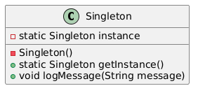
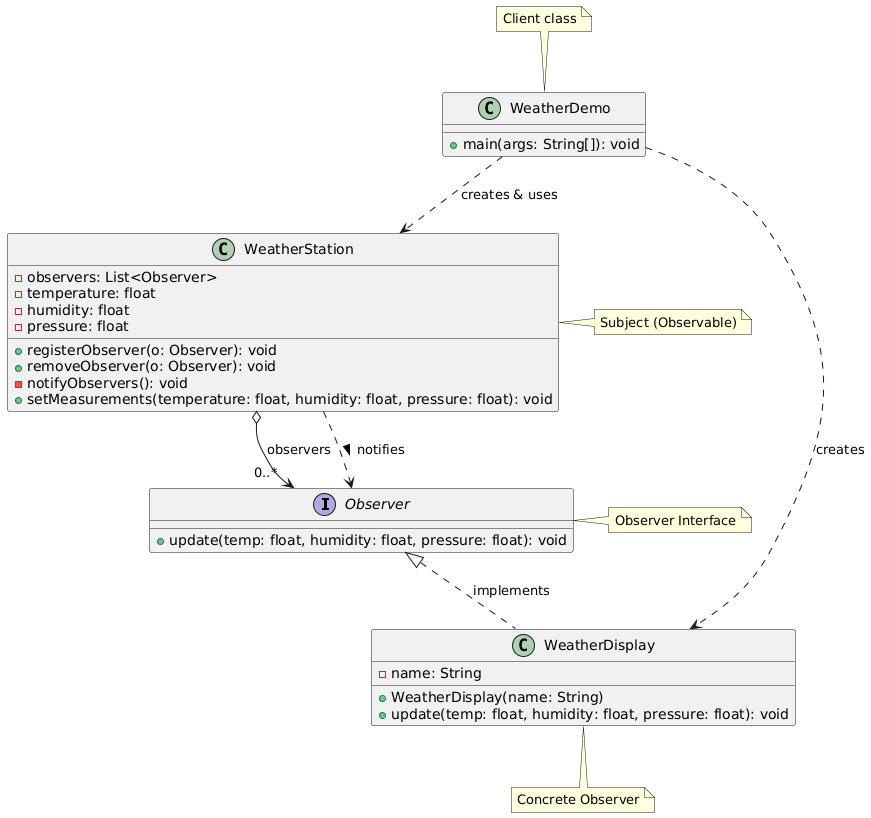
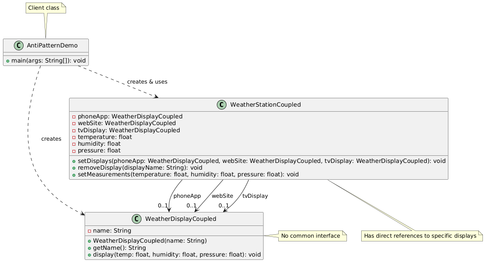
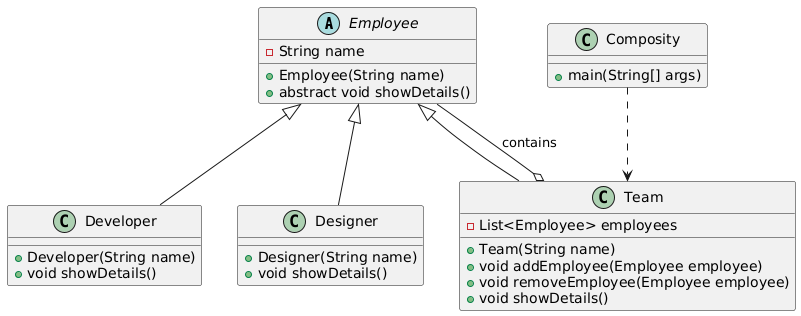
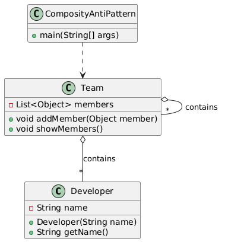
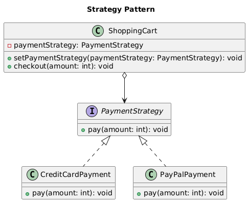

# Padrões de Projeto

Este repositório contém exemplos de padrões de projeto (Design Patterns) e seus respectivos anti-patterns. Abaixo, você encontrará um resumo de cada padrão, as diferenças entre o padrão e o anti-pattern correspondente, e diagramas UML para facilitar o entendimento.

---

## 1. Singleton

### Resumo
O padrão Singleton garante que uma classe tenha apenas uma instância e fornece um ponto global de acesso a ela. É útil para gerenciar recursos compartilhados, como conexões de banco de dados ou configurações globais.

### Sobre singleton
- **Singleton**: Controla o número de instâncias, garantindo que apenas uma seja criada.

### UML
#### Singleton

---

## 2. Observer

### Resumo
O padrão Observer define uma dependência um-para-muitos entre objetos, de forma que, quando um objeto muda de estado, todos os seus dependentes são notificados automaticamente.

### Diferenças entre Observer e Anti-pattern
- **Observer**: Promove o desacoplamento entre os objetos, facilitando a escalabilidade.
- **Anti-pattern**: Dependências diretas entre objetos, dificultando a manutenção e introduzindo fragilidade no sistema.

### UML
#### Observer

#### Anti-pattern

---

## 3. Composite

### Resumo
O padrão Composite permite que objetos sejam organizados em estruturas de árvore para representar hierarquias parte-todo. Ele trata objetos individuais e composições de objetos de maneira uniforme.

### Diferenças entre Composite e Anti-pattern
- **Composite**: Promove a composição de objetos em estruturas de árvore, facilitando a manipulação de hierarquias complexas.
- **Anti-pattern**: Implementações que não tratam objetos compostos e individuais de forma uniforme, resultando em código redundante e difícil de manter.

### UML
#### Composite

#### Anti-pattern

---

## 4. Strategy

### Resumo
O padrão Strategy define uma família de algoritmos, encapsula cada um deles e os torna intercambiáveis. Ele permite que o algoritmo varie independentemente dos clientes que o utilizam.

### Diferenças entre Strategy e Anti-pattern
- **Strategy**: Encapsula a lógica em classes separadas, promovendo a reutilização e a flexibilidade.
- **Anti-pattern**: Lógica de decisão embutida no código do cliente, dificultando a manutenção e a extensão.

### UML
#### Strategy

#### Anti-pattern

---